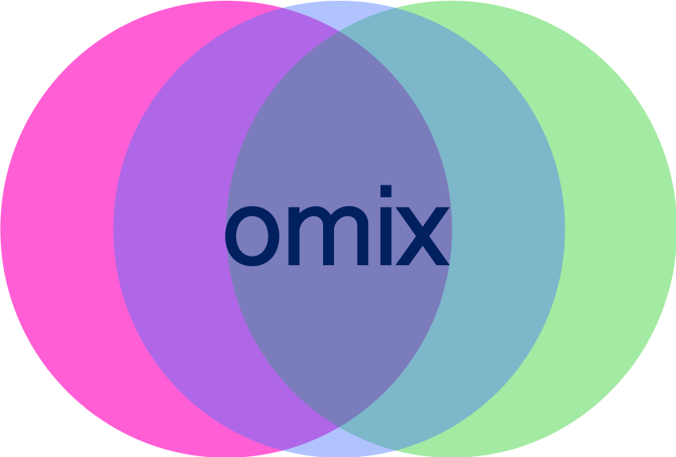
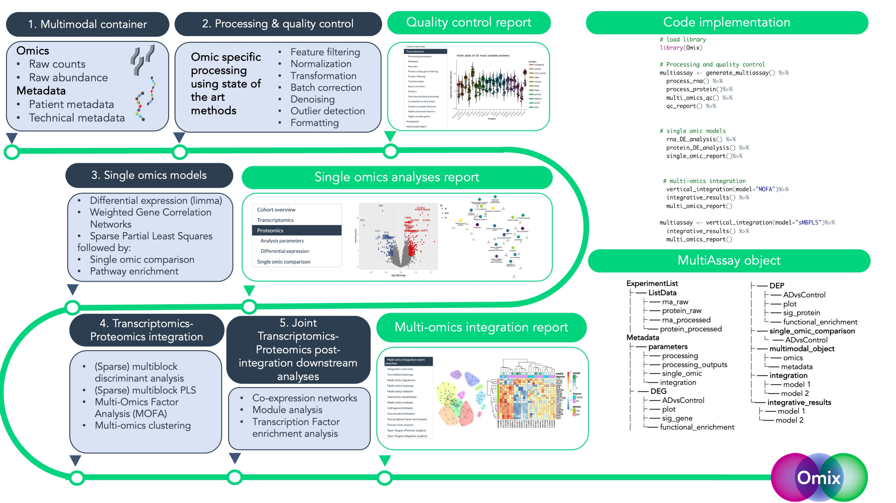

<!-- README.md is generated from README.Rmd. Please edit that file -->



<!-- badges: start -->

[](https://www.gnu.org/licenses/gpl-3.0)
<!-- badges: end -->

## Omix: A Transcriptomics-Proteomics Integration Pipeline

The `Omix` pipeline is a specialised framework for pre-processing,
analysing, integrating, and visualising bulk transcriptomics and
proteomics data. By embedding state of the art bioinformatics tools with
novel features into a user-friendly wrapper, Omix streamlines the
integrative analysis of bulk transcriptomics and proteomics data,
thereby facilitating complex biological investigations, from biomarker
discovery to patient stratification.

Pipeline outputs are standardised and include publication-quality plots,
tables, and interactive reports.



The Omix pipeline offers an integration and analysis framework for
multi-omics intended to pre-process, analyse, and visualise multimodal
data flexibly to address research questions. Omix is a wrapper tool
built on five consecutive blocks, (1) preparation of the multimodal
container, (2) data processing and quality control, (3) single omic
analyses, and (4) Transcriptomics-Proteomics vertical integration, (5)
Joint Transcriptomics-Proteomics post-integration downstream analyses

## Installation

You can install the development version of Omix from
[GitHub](https://github.com/) with:

``` r
# install.packages("devtools")
devtools::install_github("eleonore-schneeg/Omix")
```

Devtools may not work on your machine, in that case use remotes:

``` r
# install.packages("remotes")
remotes::install_github("eleonore-schneeg/Omix")
```

If you’re facing difficulties to download SynapseR, run the following
before reinstalling Omix

``` r
# install.packages("remotes")
remotes::install_github("Sage-Bionetworks/synapser", ref = '1.0')
```

## Overview of Omix features

-   Multi-omics data container
    -   The Omix multimodal container harmonises data management of
        multiple omics datasets. It enables the storage of raw and
        processed omics data slots, along with patient metadata,
        technical metadata, analysis parameters and outputs. The object
        structure relies on the [MultiAssayExperiment
        library](https://bioconductor.org/packages/release/bioc/html/MultiAssayExperiment.html)
-   Data processing & Quality Control
    -   Each omics layer is processed separately according to best
        practices. Given the wide range of processing functionalities,
        users decide which parameters and steps of the modular sequence
        are performed, which involves all or a combination of the
        folllowing steps:
    -   Feature filtering
    -   Normalisation/ transformation
    -   Batch correction & denoising
    -   Sample outlier removal
    -   Formatting
-   Single platform models
    -   Omix provides a suite of analysis options including differential
        analysis (DE), a standard method to identify genes that are
        differentially expressed between certain disease states;
        [Weighted Gene correlation Network
        (WGCNA)](https://cran.r-project.org/web/packages/WGCNA/index.html),
        to identify modules of genes that associate to certain disease
        covariates; [sparse Partial Least Square
        (sPLS)](http://mixomics.org) to define a sparse set of omics
        features, or molecular signature, that explains the response
        variable.
-   Vertical integration for joint analysis
    -   Omix provides a series of state-of-the-art integration models to
        perform patient-specific multi-omic integration, including:
    -   [MOFA](https://biofam.github.io/MOFA2/)
    -   [MEIFESTO](https://biofam.github.io/MOFA2/)
    -   [Sparse Multi-Block PLS (sMB-PLS)](http://mixomics.org)
    -   [DIABLO](http://mixomics.org)
    -   Multi-omics clustering models such as
        [iCluster](https://rdrr.io/bioc/iClusterPlus/man/iCluster.html)
-   Downstream analyses
    -   Multi-omics integration is followed by a series of downstream
        analyses, including:
    -   Multi-omics networks with [iGraph](https://igraph.org)
    -   Community detection with the [Louvain or Leiden clustering
        algorithms](https://igraph.org)
    -   Pseudotime inference with
        [Slingshot](https://bioconductor.org/packages/release/bioc/html/slingshot.html)
    -   Functional enrichment with
        [EnrichR](https://maayanlab.cloud/Enrichr/)
    -   Cell-type enrichment with
        [EWCE](https://bioconductor.org/packages/release/bioc/html/EWCE.html)
    -   Target validation based on the
        [OpenTargets](https://www.opentargets.org) database
    -   Publication quality plots and analysis reports

Omix implements these modular steps and displays results in interactive
reports.

## Getting started

The Getting Started section of the documentation contains downloadable
examples on how to use Omix.

## Data

The experiments described in our vignettes rely on in-house data from
the Multi-Omics Atlas Project, which may be obtained from the [synapse
portal](https://www.synapse.org/#!Synapse:syn36812517/wiki/619350) for
registered users. (Project SynID: syn36812517)

#### Datasets:

-   Get started data: syn51533729
-   Pseudo-temporal multi-omics integration data: syn51516099
    <https://doi.org/10.7303/syn51516099>

## Docker image

For reproducibility purposes, we provide a Docker container
[here](https://hub.docker.com/r/eleonoreschneeg/omix).

After installing Docker you can first pull the container via:

``` bash
docker pull eleonoreschneeg/omix:latest
```

and then run the container:

``` bash
docker run --rm -d -v $HOME:/home/rstudio/home -e ROOT=true -e PASSWORD=password -p 8787:8787 eleonoreschneeg/omix:latest
```

An RStudio server session can be accessed via a browser at
localhost:8787 using Username: rstudio and Password: password

## Citation

Please cite `Omix` as:

Eléonore Schneegans, Nurun Fancy, Michael Thomas, Nanet Willumsen, Paul
M Matthews, Johanna Jackson (2023) Omix: A Transcriptomics-Proteomics
Integration Pipeline

## Contributing

For feature requests, please open an issue
[here](https://github.com/eleonore-schneeg/Omix/issues).

Alternatively, you can fork the repository, add your change and issue a
pull request.
