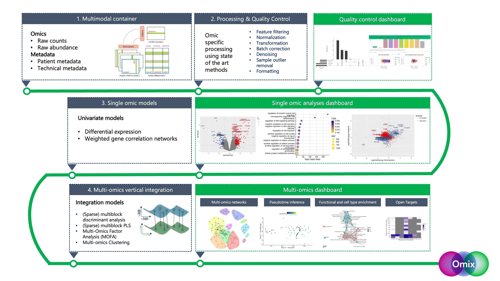

<!-- README.md is generated from README.Rmd. Please edit that file -->


# Omix

<!-- badges: start -->

[](https://www.gnu.org/licenses/gpl-3.0)
<!-- badges: end -->

The Omix pipeline provides a generalisable framework that can
effectively process, visualise and analyse patient-specific multi-omic
data in an end-to-end manner. Omix is built on four consecutive blocks,
summarised in the figure below.



This bioinformatics pipeline aims to address important gaps related to
the integration of multi-omics data, namely by enabling the
reproducibility of integrative analyses and providing grounds for more
systematic benchmarking of analyses. Pipeline outputs are standardized
and include publication-quality plots, tables, and interactive
dashboards.

## Installation

You can install the development version of Omix from
[GitHub](https://github.com/) with:

``` r
# install.packages("devtools")
devtools::install_github("eleonore-schneeg/Omix")
```

## Overview of Omix features

-   Multi-omics data container
    -   The Omix multimodal container harmonises data management of
        multiple omics datasets. It enables the storage of raw and
        processed omics data slots, along with patient metadata,
        technical metadata, analysis parameters and outputs. The object
        structure relies on the [MultiAssayExperiment
        library](https://bioconductor.org/packages/release/bioc/html/MultiAssayExperiment.html)
-   Data processing & Quality Control
    -   Each omics layer is processed separately according to best
        practices. Given the wide range of processing functionalities,
        users decide which parameters and steps of the modular sequence
        are performed, which involves all or a combination of the
        folllowing steps:
    -   Feature filtering
    -   Normalisation/ transformation
    -   Batch correction & denoising
    -   Sample outlier removal
    -   Formatting
-   Single platform models
    -   Omix provides a suite of analysis options including differential
        analysis (DE), a standard method to identify genes that are
        differentially expressed between certain disease states;
        [Weighted Gene correlation Network
        (WGCNA)](https://cran.r-project.org/web/packages/WGCNA/index.html),
        to identify modules of genes that associate to certain disease
        covariates; [sparse Partial Least Square
        (sPLS)](http://mixomics.org) to define a sparse set of omics
        features, or molecular signature, that explains the response
        variable.
-   Vertical integration for joint analysis
    -   Omix provides a series of state-of-the-art integration models to
        perform patient-specific multi-omic integration, including:
    -   [MOFA](https://biofam.github.io/MOFA2/)
    -   [Sparse Multi-Block PLS (sMB-PLS)](http://mixomics.org)
    -   [DIABLO](http://mixomics.org)
    -   A range of multi-omics clustering models implemented in
        [MOVICS](https://github.com/xlucpu/MOVICS)
-   Downstream analyses
    -   Multi-omics integration is followed by a series of downstream
        analyses, including:
    -   Multi-omics networks with [iGraph](https://igraph.org)
    -   Community detection with the [Louvain or Leiden clustering
        algorithms](https://igraph.org)
    -   Pseudotime inference with
        [Slingshot](https://bioconductor.org/packages/release/bioc/html/slingshot.html)
    -   Functional enrichment with
        [EnrichR](https://maayanlab.cloud/Enrichr/)
    -   Cell-type enrichment with
        [EWCE](https://bioconductor.org/packages/release/bioc/html/EWCE.html)
    -   Target validation based on the
        [OpenTargets](https://www.opentargets.org) database
    -   Publication quality plots and analysis reports

Omix implements these modular steps and displays results in an
interactive results dashboard.

The package functions are designed to interface neatly with NextFlow for
scalable and containerized pipelines deployed locally, on
high-performance computing clusters, or in the cloud. See
<https://nf-co.re/omix> for the accompanying NextFlow pipeline.
