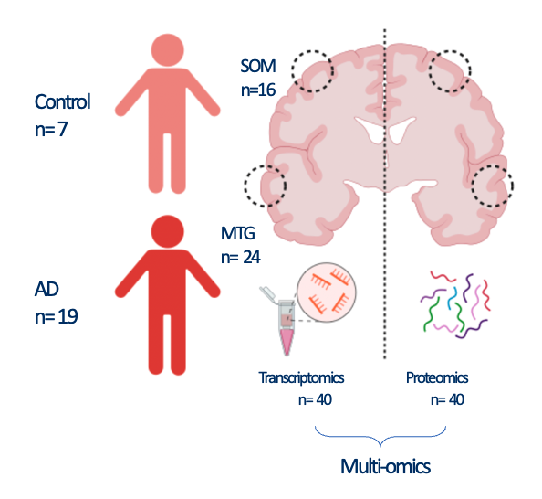

```{r style, echo=FALSE, results='asis', message=TRUE, warning=FALSE}
BiocStyle::markdown()
knitr::opts_chunk$set(tidy = FALSE,
                      message = TRUE,
                      warning = FALSE)
options(knitr.duplicate.label = "allow")
```

# Overview

The goal of Omix is to provide tools in R to build a complete analysis workflow 
for integrative analysis of data generated from multi-omics platform.

-   Generate a multi-omics object using `MultiAssayExperiment`.

-   Quality control of single-omics data.

-   Formatting, normalisation, denoising of single-omics data.

-   Separate single-omics analyses.

-   Integration of multi-omics data for combined analysis. 

-   Publication quality plots and interactive analysis reports based of shinyApp.

Currently, Omix supports the integration of bulk transcriptomics and bulk proteomics.

## Running *Omix*

The `Omix` pipeline requires the following input:

-   `rawdata_rna`: A data-frame containing raw RNA count with rownames as gene and colnames as samples.

-   `rawdata_protein`:  A data-frame containing protein abundance with rownames as proteins and colnames as samples.

-   `map_rna`: A data-frame of two columns named `primary` and `colname` where primary should contain unique sample name with a link to sample metadata and colname is the column names of the `rawdata_rna` data-frame.

-   `map_protein`: A data-frame of two columns named `primary` and `colname` where primary should contain unique sample name with a link to sample metadata and colname is the column names of the `rawdata_protein` data-frame. 

-   `metadata_rna`: A data-frame containing `rna` assay specific metadata where rownames are same as the colnames of `rawdata_rna` data.frame.

-   `metadata_protein`: A data-frame containing `protein` assay specific metadata where rownames are same as the colnames of `rawdata_protein` data.frame.

-   `individual_metadata`: A data-frame containing individual level metadata for both omics assays.


Call required packages for vignette:

```{r results='asis', message=FALSE, warning=FALSE}
library(Omix)
library(purrr)
library(ggplot2)
library(dplyr)
library(synapser)
library(tibble)
```

First we must load the data from Omix for the vignette:

```{r results='asis', message=FALSE, warning=FALSE}
outputDir <- tempdir()
ctd_fp <-file.path(outputDir, "ctd.rds")
ensembl_fp  <-file.path(outputDir, "ensembl.rds")
TF_fp <- file.path(outputDir, "Enrichr_Queries.gmt.txt")
GO_fp <- file.path(outputDir, "GO_Biological_Process_2021.txt")


download.file(url = "https://raw.githubusercontent.com/eleonore-schneeg/OmixData/main/ctd-2.rds",destfile=ctd_fp ,headers = c(Authorization = paste("token", Sys.getenv("GH_TOKEN"))))

download.file(url = "https://raw.githubusercontent.com/eleonore-schneeg/OmixData/main/ensembl_mappings_human.tsv",destfile=ensembl_fp ,headers = c(Authorization = paste("token", Sys.getenv("GH_TOKEN"))))

download.file(url = "https://raw.githubusercontent.com/eleonore-schneeg/OmixData/main/Enrichr_Queries.gmt.txt",destfile=TF_fp ,headers = c(Authorization = paste("token", Sys.getenv("GH_TOKEN"))))

download.file(url = "https://raw.githubusercontent.com/eleonore-schneeg/OmixData/main/GO_Biological_Process_2021.txt",destfile=GO_fp ,headers = c(Authorization = paste("token", Sys.getenv("GH_TOKEN"))))


synapser::synLogin(email=Sys.getenv("SYNAPSE_ID"), password=Sys.getenv("SYNAPSE_PASSWORD"))
rawdata_rna <- read.csv(synapser::synGet('syn51516100')$path, header=T, stringsAsFactors = F, row.names=1)
rawdata_protein <- read.csv(synapser::synGet('syn51516105')$path, header=T, stringsAsFactors = F, row.names=1)
map_rna <-read.csv(synapser::synGet('syn51516102')$path, header=T, stringsAsFactors = F, row.names=1)
map_prot <- read.csv(synapser::synGet('syn51516104')$path, header=T, stringsAsFactors = F, row.names=1)
metadata_rna<-read.csv(synapser::synGet('syn51516103')$path, header=T, stringsAsFactors = F, row.names=1)
metadata_prot <- read.csv(synapser::synGet('syn51516106')$path, header=T, stringsAsFactors = F, row.names=1)
individual_metadata <-read.csv(synapser::synGet('syn51516101')$path, header=T, stringsAsFactors = F, row.names=1)
clusters<-readRDS(synapser::synGet('syn51516107')$path)
integrative_model<-readRDS(synapser::synGet('syn51520491')$path)

ctd <-  readRDS(paste0(outputDir,'/ctd.rds'))
ensembl <-read.delim(file=paste0(outputDir,'/ensembl.rds'), sep = '\t', header = TRUE)
rna_qc_data_matrix <- NULL
```

Sanity check 

```{r}

all(rownames(metadata_rna) == colnames(rawdata_rna))
all(rownames(metadata_prot) == colnames(rawdata_protein))

```


### Raw rna counts

`rawdata_rna` is a data-frame of raw counts, with features as rows and samples as columns

```{r}
print(rawdata_rna[1:5,1:5])
```


### Raw protein abundance

`rawdata_protein` is a data-frame of raw protein abundances, with features as rows and samples as columns

```{r}
print(rawdata_protein[10:15,10:15])
```

### Maps

Maps are data frame containing two columns: `primary` and `colname`. 
The `primary` column should be the individual ID the individual metadata, and the 
`colname` the matched sample names from the raw matrices columns. If sample and
individual ids are the same, maps aren't needed (primary and colnames are the same).

```{r}
print(head(map_prot))
print(head(map_rna))
```

### Technical metadata

Technical metadata are data-frames contain the column `colname` that should match
the sample names in the raw matrices, and any additional columns related to technical artefacts like batches 

```{r}
print(head(metadata_rna))
print(head(metadata_prot))
```


### Individual metadata

`individual_metadata` should contain individual level metadata, where one column matches the `primary` column in maps.

```{r}
print(head(individual_metadata))
```

### Optional inputs

Optional inputs contain additional data frame used for QC visualisation purposes 

```{r}
print(head(rna_qc_data_matrix))
```


#  Step one - Generate a MultiAssayExperiment object

To run Omix, we first need to generate a multi-omics object
The package currently supports transcriptomics and proteomics bulk data only.


```{r  warning=FALSE}

individual_metadata$diagnosis <- factor(individual_metadata$diagnosis,
                                        levels = c("Control", "AD"))
individual_metadata$sex <- factor(individual_metadata$sex)

multiomics_object=generate_multiassay(rawdata_rna =rawdata_rna,
                                   rawdata_protein = rawdata_protein,
                                   individual_to_sample=FALSE,
                                   map_rna = map_rna,
                                   map_protein = map_prot,
                                   metadata_rna = metadata_rna,
                                   metadata_protein = metadata_prot,
                                   individual_metadata = individual_metadata,
                                   map_by_column = 'sample_id',
                                   rna_qc_data=FALSE,
                                   rna_qc_data_matrix=NULL,
                                   organism='human')
```


The MultiAssayExperiment object was succesfully created. 
The following steps will process and perform QC on each omic layers of the 
`multiomics_object` object.

# Step two - Process transcriptomics data

```{r  warning=FALSE}
multiomics_object=process_rna(multiassay=multiomics_object,
            transformation='rlog',
            protein_coding=TRUE,
            min_count = 10,
            min_sample = 0.5,
            dependent =  "diagnosis",
            levels = c("Control","AD"),
            covariates=c('age','sex','PMD'),
            filter=TRUE,
            batch_correction=TRUE,
            batch=NULL,
            remove_sample_outliers= FALSE)
```

# Step three - Process proteomics data

```{r  warning=FALSE}
multiomics_object=process_protein(
    multiassay=multiomics_object,
    filter=TRUE,
    min_sample = 0.5,
    dependent =  "diagnosis",
    levels = c("Control","AD"),
    imputation = 'minimum_value',
    remove_feature_outliers= FALSE,
    batch_correction= FALSE,
    batch="batch",
    correction_method="median_centering",
    remove_sample_outliers=FALSE,
    denoise=TRUE,
    covariates=c('PMD','sex','age'))
```

# Step four - Vertical integration

**Omix** supports a range of vertical integration models:

-   Possible integration methods are `MOFA`,`DIABLO`,`sMBPLS`,`iCluster`,`MEIFESTO`

-   The choice of the integration models depends on the research use case of interest.

-   Here we display the use of **Omix** on a popular integration method, MOFA or Multi-Omics Factor analysis (Argelaguet et al. 2018).

-   The `Meifesto`model is an extension of `MOFA`to enable time as a covariate.

> In this vignette, we proceed with a pseudotemporal multi-omics integration of 40 brain Alzheimer's disease (AD) and Control samples coming from two brain regions

> -   The somatosensory cortext (SOM)

> -   The middle frontal gyrus (MTG)

 The MTG is known to be affected earlier during AD progression, while SSC at later stages. Using these two regions as pseudotemporal proxi in the integrative process, we are able to gain a deeper understanding of biological mechanisms that occur during AD progression.
 
```{r echo=FALSE}

```
 
## Pseudotemporal multi-omics integration using MOFA 

```{r echo=FALSE}
multiomics_object <- readRDS("~/omix_new/multiassay_mofa.rds")
```


```{r warning=FALSE, eval =FALSE }
multiomics_object=vertical_integration(multiassay=multiomics_object,
                                slots = c(
                                   "rna_processed",
                                   "protein_processed"
                                 ),
                                integration='MOFA',
                                ID_type = "gene_name",
                                dependent='diagnosis',
                                intersect_genes = FALSE,
                                num_factors = 15,
                                scale_views = FALSE,
                                most_variable_feature=TRUE)
```

The integration process is successful and all integration related object are stored in the `integration` slot of the multi-omics object.

```{r}
print(multiomics_object@metadata$integration$MOFA)
```


## Optional: load a pretrained model 

Since package version slightly affect model outputs, we reload a pre-trained model.

```{r}
multiomics_object@metadata$integration$MOFA=integrative_model
```

# Step five - Post integration downstream analyses 

**Omix** provides a range of built-in downstream analyses functions and visualisations.
All downstream analyses will be performed on the integrated object stored in the `integrated` slot.

## Load integrated object

```{r, message=FALSE}
integrated_object=multiomics_object@metadata$integration$MOFA
metadata=integrated_object@samples_metadata
```


## Factor explorations 

### Variance explained 

```{r echo=TRUE, message=FALSE, warning=FALSE}
MOFA2::plot_variance_explained(integrated_object, max_r2=10)
```

### Correlation of factors with covariates 

```{r echo=TRUE, message=FALSE, warning=FALSE}

integrated_object@samples_metadata$SOM=ifelse(integrated_object@samples_metadata$brain_region=='SOM',1,0)
plot=correlation_heatmap(integrated_object,
                   covariates=c("AD","Braak",'MTG','SOM',
                               'amyloid','pTau','PHF1'))

```

Factors 6 and 8 will be chosen for downstream analysis:

-   Factor 6: Is strongly correlated with neuropathological variables including PHF1 and amyloid.

-   Factor 8: Is strongly correlated with pseudotemporal covariates, MTG and SOM

-   Both share some level of variance explained by the transcriptomics and proteomics layers

> Consequentially, If we project samples on these two axis of variation, we can infer on the pseudotemporal trajectory of neuropathology at the RNA and protein level.

## Integrated latent space

### Chosen integrated axes of variation

```{r echo=TRUE}

MOFA2::plot_factors(integrated_object,
             factors=c(8,6),
             color_by='PHF1', shape_by = 'brain_region', scale = T)+
              xlab('Factor 8 ~ Pseudotime' )+
              ylab('Factor 6 ~ Neuropathology' )  

```

###  Pseudotime inference with Slingshot 

The goal of `slingshot` (Street et al. 2017), is to use clusters of cells to uncover global structure and convert this structure into smooth lineages represented by one-dimensional variables, called “pseudotime.”

> Here, we extend the use of `slingshot` to infer on individual level pseudotime to infer on Alzheimer's disease trajectory.

`slingshot` takes a matrix of embeddings in reduced dimension as input, which here are Factors 8 and 6 from the `MOFA` multi-omics integration.
We can optionally specify the cluster to start or end the trajectory based on biological knowledge. Here, the starting cluster should be `1` as it coincides with lowest neuropathology levels and most "recent" affected region in terms of AD trajectory. 


```{r echo=TRUE}
#clusters=MOFA2::cluster_samples(integrated_object, 
#                         k=3,
#                         factors = c(8,6))

#load clusters for reproducibility
MOFA2::plot_factors(integrated_object,
             factors=c(8,6),
             color_by=clusters$cluster, scale = F)

```


```{r echo=TRUE}
pseudotime=pseudotime_inference(integrated_object,
                                 clusters,
                                 time_factor=8,
                                 second_factor=6,
                                 start.clus = 1,
                                 end.clus=3,
                                 lineage = 'Lineage1')

pseudotime$plot

```

### Update the integrated_object with the pseudotime
 
```{r echo=TRUE}
multiomics_object@metadata$integration$MOFA=pseudotime$model
integrated_object=multiomics_object@metadata$integration$MOFA
MOFA2::samples_metadata(integrated_object)$inferred_pseudotime
```

## Extract features that are driving Factor 6 based on feature weights 

Weights vary from -1 to +1, and provide a score for how strong each feature relates to each factor, hence allowing a biological interpretation of the latent factors. 
Features with no association with the factor have values close to zero, while genes with strong association with the factor have large absolute values. 

The sign of the weight indicates the direction of the effect: 

-   A positive weight indicates that the feature has higher levels in the samples with positive factor values.

-   A negative weight indicate higher levels in samples with negative factor values.


The `extract_weigths`function enable to extract the weights on the desired factor at a defined absolute threshold, and return an object with positive and negative weights above and below this threshold respectively.
It also returns QC plots

-   A distribution of the feature weights for each omic layer at the designated factor

-   The relationship between the feature/`sense_check_variable` correlation and weights. High weights should coincide with stronger correlation if the `sense_check_variable` is an important driver of variation in the designated factor.


```{r}
weights=extract_weigths(integrated_object,
                           factor=6,
                           threshold=0.2,
                           sense_check_variable='PHF1')
```

### Weights distribution in Factor 6

```{r}
weights$distribution_plot$rna  
weights$distribution_plot$protein

```

### Correlation to PHF1 and weights in Factor 6

```{r}
weights$weights_cor_plot$rna
weights$weights_cor_plot$protein
```

## Negative weights in factor 6: Up-regulated in later stage AD

A negative weight indicates that the feature has higher levels in the samples with negative factor values, which in this analysis coincides with later Braak stages.

```{r echo=TRUE}
integrated_object@samples_metadata$Braak=as.factor(integrated_object@samples_metadata$Braak)
MOFA2::plot_factor(integrated_object, 
            factors = 6, 
            color_by = "Braak",
            add_violin = TRUE,
            dodge = TRUE
)
```


### Selected features based on defined threshold


-   `r `length(weights$weights$ranked_weights_negative$rna)` RNAs have weights below -0.3 in factor 6

-   `r length(weights$weights$ranked_weights_negative$protein)` proteins have weights below -0.3 in factor 6

Some driving features may overlap between transcriptomics and proteomics

```{r}
intersect(weights$weights$ranked_weights_negative$rna,weights$weights$ranked_weights_negative$protein)
```

-   `r length(intersect(weights$weights$ranked_weights_positive$rna,weights$weights$ranked_weights_positive$protein))` features overlap between omic layers


## Multi-omics network 


-   Here we choose a moderate correlation threshold to draw edges between omic features (0.4)

-   The same analysis can be repeated with an increased correlation threshold, which will yield more modules of strongly co-expressed features.

```{r}

Weights_down_n=multiomics_network(multiassay=multiomics_object,
                           list=weights$weights$ranked_weights_negative,
                           correlation_threshold =0.4,
                           filter_string_50= TRUE)

```

### Community detection within multi-omic network


The next step of the analysis is to find densily co-expressed communities of proteins and RNAs within the multi-omics network.
 
This function tries to find densely connected subgraphs in a graph by calculating the leading non-negative eigenvector of the modularity matrix of the graph.

```{r}
communities <- communities_network(igraph=Weights_down_n$graph,
                                    community_detection='leading_eigen')

```

```{r}
df <- purrr::map_dfr(
    .x = communities$communities,
    .f = ~ tibble::enframe(
      x = .x,
      name = NULL,
      value = "feature"
    ),
    .id = "community"
  )

DT::datatable(
    df,
    rownames = FALSE,
    extensions = 'Buttons',
    options = list(
        dom = 'Blfrtip',
         buttons = list('colvis', list(extend = 'copy', exportOptions = list(columns=':visible')),
                                            list(extend = 'csv', exportOptions = list(columns=':visible')),
                                            list(extend = 'excel', exportOptions = list(columns=':visible')))))
```


-    `r length(communities$communities)` communities are detected in the multi-omics network.
-    Most communities are omic dependent, since generally there is more intra omic correlation than inter omic correlation


### Community detection within multi-omic network


We can look at each communities:

### Community 1 

```{r}

community_1=community_graph(igraph=Weights_down_n$graph,
                            community_object=communities$community_object,
                            community=1)
interactive_network(igraph=community_1$graph,communities=FALSE)
```

### Community 4

```{r}

community_4=community_graph(igraph=Weights_down_n$graph,
                            community_object=communities$community_object,
                            community=4)
interactive_network(igraph=community_4$graph,communities=FALSE)
```

### Community hubs 


-   Features are more or less connected in the network, represented by their hub score: 

```{r}
print((sort(community_4$hubs, decreasing = TRUE)))
```


- Top gene in module 4 is `r names(sort(community_4$hubs, decreasing = TRUE)[1])`
- TREM2 or CLU, known AD risk genes expressed on microglia are present here
- From prior knowledge, many of the genes in module 4 are related to microglial activation


## Cell type enrichment of modules

Here we proceed with a `EWCE` analysis to check if modules are enriched in specific cell types.

```{r, message=FALSE}
cell_type <- cell_type_enrichment(
    multiassay =multiomics_object,
    communities = lapply(communities$communities,function(x){sub("\\_.*", "",x )}),
    ctd= ctd
  )

cell_type$plots
```

- We find one neuronal, one microglial and two undefined glial enriched modules.

## Pathway enrichment analysis 


```{r}
communities_l = lapply(communities$communities,function(x){sub("\\_.*", "",x )})

enrichment1=pathway_analysis_enrichr(communities_l$`1`,plot=5)
enrichment2=pathway_analysis_enrichr(communities_l$`2`,plot=5)
enrichment3=pathway_analysis_enrichr(communities_l$`3`,plot=5)
enrichment4=pathway_analysis_enrichr(communities_l$`4`,plot=5)
enrichment5=pathway_analysis_enrichr(communities_l$`5`,plot=5)

enrichment1$plot$Reactome_2016+theme(axis.text=element_text(size=12),
                                     axis.title=element_text(size=12),
                                     strip.text = element_text(size = 0, margin = margin()),
                                     legend.title = element_text(size=9))
enrichment2$plot$Reactome_2016+theme(axis.text=element_text(size=12),
                                     axis.title=element_text(size=12),
                                     strip.text = element_text(size = 0, margin = margin()),
                                     legend.title = element_text(size=9))
enrichment3$plot$Reactome_2016+theme(axis.text=element_text(size=12),
                                     axis.title=element_text(size=12),
                                     strip.text = element_text(size = 0, margin = margin()),
                                     legend.title = element_text(size=9))
enrichment4$plot$Reactome_2016+theme(axis.text=element_text(size=12),
                                     axis.title=element_text(size=12),
                                     strip.text = element_text(size = 0, margin = margin()),
                                     legend.title = element_text(size=9))
enrichment5$plot$Reactome_2016+theme(axis.text=element_text(size=12),
                                     axis.title=element_text(size=12),
                                     strip.text = element_text(size = 0, margin = margin()),
                                     legend.title = element_text(size=9))

```


## Modules correlation to neuropathology 


`multiomics_modules` compute the module eigen value (PC1 of scaled transcriptomics/proteomics expression) and correlates it to chosen covariates

```{r, message= FALSE, warning=FALSE}
modules=multiomics_modules(multiassay=multiomics_object,
                              metadata=MOFA2::samples_metadata(integrated_object),
                              covariates=c('inferred_pseudotime','PHF1','amyloid','pTau'),
                              communities=communities$communities,
                              filter_string_50=TRUE)
```

## Transcription Factor - target gene enrichment 

```{r}
TF=Transcription_Factor_enrichment(communities=communities$communities,
                                   weights=weights,
                                   TF_gmt=TF_fp,
                                   threshold = 0.2,
                                   direction = "negative") 

GeneOverlap::drawHeatmap(TF,what = c("odds.ratio"), log.scale = T, adj.p = F, cutoff = .05,
                          ncolused = 7, grid.col = c("Blues"), note.col = "red")

```

## TF-target gene circos plot 

```{r out.width = "100%"}
circos_TF(TF)
```


## Pseudotime ordering of multi-omics modules 

- Here we related each module eigen value to the pseudotime inferred from MOFA integration emmbeddings (Factors 6/8)

```{r}

plot_module_trajectory(modules=modules,
                                   covariates=c('amyloid','pTau','PHF1'),
                                   plot_modules=c("ME1","ME2","ME3","ME4"))

```


### Pseudotime vs Braak

> We find a stronge correlation between inferred pseudotime and PHF1, indicating that the pseudotemporal multiomics integration provides an accurate assessment of AD progression, encompassing all neuropathological measures 

### PHF1

```{r, message= FALSE}
modules$metadata_modules$Braak=factor(modules$metadata_modules$Braak, levels = c("0","1","2","3","4","5","6"))
modules$metadata_modules$Braak_num=as.numeric(modules$metadata_modules$Braak)
gg=ggpubr::ggscatter(modules$metadata_modules, y = "PHF1", x = "Braak_num", palette = "jco",
                     add = "reg.line", conf.int = TRUE,  label.x = 4,  add.params = list(color = "blue", fill = "lightgray"), # Customize reg. line
                     cor.coef = TRUE, # Add correlation coefficient. see ?stat_cor
                     cor.coeff.args = list(method = "pearson", label.sep = "\n"))
gb=ggpubr::ggscatter(modules$metadata_modules, y = "PHF1", x = "inferred_pseudotime", palette = "jco",
                     add = "reg.line", conf.int = TRUE,   add.params = list(color = "blue", fill = "lightgray"), # Customize reg. line
                     cor.coef = TRUE, # Add correlation coefficient. see ?stat_cor
                     cor.coeff.args = list(method = "pearson", label.x = 4, label.sep = "\n"))
plot(gg)
plot(gb)
```

### Amyloid 

```{r, message= FALSE}
modules$metadata_modules$Braak=factor(modules$metadata_modules$Braak, 
                                      levels = c("0","1","2","3","4","5","6"))
modules$metadata_modules$Braak_num=as.numeric(modules$metadata_modules$Braak)
gg=ggpubr::ggscatter(modules$metadata_modules, y = "amyloid", x = "Braak_num", palette = "jco",
                     add = "reg.line", conf.int = TRUE,  label.x = 4,  add.params = list(color = "blue", fill = "lightgray"), # Customize reg. line
                     cor.coef = TRUE, # Add correlation coefficient. see ?stat_cor
                     cor.coeff.args = list(method = "pearson", label.sep = "\n"))
gb=ggpubr::ggscatter(modules$metadata_modules, y = "amyloid", x = "inferred_pseudotime", palette = "jco",
                     add = "reg.line", conf.int = TRUE,   add.params = list(color = "blue", fill = "lightgray"), # Customize reg. line
                     cor.coef = TRUE, # Add correlation coefficient. see ?stat_cor
                     cor.coeff.args = list(method = "pearson", label.x = 4, label.sep = "\n"))
plot(gg)
plot(gb)
```

## Relationship with diagnosis

```{r, message= FALSE}
for(i in colnames(modules$modules_eigen_value)){
gg=ggpubr::ggscatter(modules$metadata_modules, 
                     x = "inferred_pseudotime", 
                     y = paste(i),
          color = "diagnosis",
          palette = "jco",
          add = "reg.line", 
          conf.int = TRUE)+
  ggpubr::stat_cor(aes(color = diagnosis), label.x = 1)
plot(gg)
}
```

## Relationship with PHF1

```{r, message= FALSE}

for(i in colnames(modules$modules_eigen_value)){
gg=ggpubr::ggscatter(modules$metadata_modules,
                     x = "PHF1", 
                     y = paste(i),
                     palette = "jco",
                     add = "reg.line", 
                     conf.int = TRUE, 
                     add.params = list(color = "blue", fill = "lightgray"), # Customize reg. line
                     cor.coef = TRUE, # Add correlation coefficient. see ?stat_cor
                     cor.coeff.args = list(method = "pearson", label.x = 2, label.sep = "\n"))


plot(gg)
}
```

There is a stronger relationhsip between module eigen values and infered multi-omics pseudotime 


## Module Eigenvalue by group boxplots 

```{r, message= FALSE}

for(i in colnames(modules$modules_eigen_value)){
gg=ggpubr::ggboxplot(modules$metadata_modules,
                     x = "diagnosis", 
                     y = paste(i),
                     add='jitter', 
                     color="diagnosis")+
  xlab('Diagnosis')+
  ylab(paste('Eigen value in',i))+
  theme_classic()+
  ggsignif::geom_signif(comparisons = list(c('AD', 'Control')))+
  scale_color_manual(values = c("#2E9FDF","#E7B800"))+
  facet_wrap(~brain_region)
plot(gg)
}
```

```{r}

for(i in colnames(modules$modules_eigen_value)){
gg=ggpubr::ggboxplot(modules$metadata_modules, 
                     x = "Braak", 
                     y = paste(i),
                     add='jitter', 
                     color="Braak")+
  xlab('Diagnosis')+
  ylab(paste('Eigen value in',i))+
  theme_classic()+
  facet_wrap(~brain_region)
plot(gg)
}
```


```{r}

for(i in colnames(modules$modules_eigen_value)){
gg=ggpubr::ggboxplot(modules$metadata_modules, 
                     x = "brain_region", 
                     y = paste(i),
                     add='jitter',
                     color='brain_region')+
  xlab('Diagnosis')+
  ylab(paste('Eigen value in',i))+
  theme_classic()+
  ggsignif::geom_signif(comparisons = list(c('MTG', 'SOM')))+
  scale_color_manual(values = c("#DC0000FF","darkblue"))
plot(gg)
}
```

```{r}
metadata=integrated_object@samples_metadata
ggplot(metadata, aes(x = brain_region, y = inferred_pseudotime,color=Braak)) +
  geom_point(size = 5, col = "firebrick", alpha = 0.5,aes(color=Braak)) +
  geom_line(aes(group = BBN_ID)) +
  labs(x = "Brain region", y = "Inferred_pseudotime") +
  theme_classic()+facet_wrap(~Braak)

ggplot(metadata, aes(x = brain_region, y = inferred_pseudotime,color=diagnosis)) +
  geom_point(size = 5, col = "firebrick", alpha = 0.5,aes(color=Braak)) +
  geom_line(aes(group = BBN_ID)) +
  labs(x = "Brain region", y = "Inferred_pseudotime") +
  theme_classic()+facet_wrap(~diagnosis)
```

```{r}
library(ggridges)
ggplot(metadata, aes(x = inferred_pseudotime, y = Braak,fill = brain_region)) +
  geom_density_ridges(aes(point_shape =diagnosis, point_fill = brain_region),
                      jittered_points = TRUE, position = "raincloud",
                      alpha = 0.7, scale = 0.9, panel_scaling=FALSE
  )+
  xlab('Inferred pseudotime')+
  ylab(paste('Braak'))+
  theme_classic()+
  labs(fill=NULL)

ggplot(metadata, aes(x = inferred_pseudotime, y =brain_region,fill = diagnosis)) +
  geom_density_ridges(aes(point_shape =diagnosis, point_fill = diagnosis),
                      jittered_points = TRUE, position = "raincloud",
                      alpha = 0.7, scale = 0.9, panel_scaling=FALSE
  )+
  xlab('Inferred pseudotime')+
  ylab(paste('Braak'))+
  theme_classic()+
  labs(fill=NULL)

```

